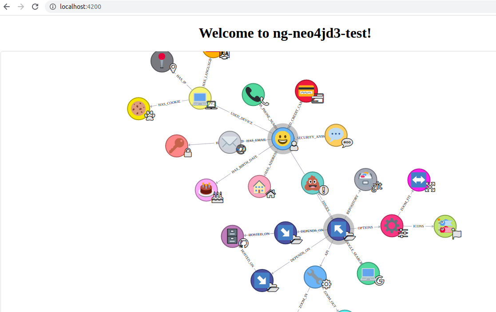

# NgNeo4jd3Test

Steps to use the library [ng-neo4jd3](https://github.com/vivopensource/ng-neo4jd3)


## Add Dependencies
- ng-neo4jd3: `npm install ng-neo4jd3` or `yarn add ng-neo4jd3`
- d3: `npm install d3` or `yarn add d3`
- font-awesome: `npm install font-awesome` or `yarn add font-awesome`


## Update 'angular.json'

Add the following code snippet with 'angular.json' file to add styling to the graphs:
  - CSS:
```
            "styles": [
              ...
              "node_modules/font-awesome/css/font-awesome.css",
              "node_modules/ng-neo4jd3/lib/assets/css/ng-neo4jd3.component.css"
            ],
```

  - SCSS
```
            "styles": [
              ...
              "node_modules/font-awesome/scss/font-awesome.scss",
              "node_modules/ng-neo4jd3/lib/assets/scss/ng-neo4jd3.component.scss"
            ],
```


## Add 'NgNeo4jd3Module' into 'app.module.ts' file:
```
import { NgNeo4jd3Module } from 'ng-neo4jd3';

@NgModule({
...
  imports: [
    ...,
    NgNeo4jd3Module
  ],
...
})
export class AppModule { }

```


## Add 'NgNeo4jd3Service' into 'app.component.ts' file or any other component file:

```
...
import { NgNeo4jd3Service } from 'ng-neo4jd3';

@Component({
  selector: 'app-root',
  templateUrl: './app.component.html',
  styleUrls: ['./app.component.scss']
})
export class AppComponent {

  ...
  constructor(public ngNeo4jD3Service: NgNeo4jd3Service) { }
  ...

```


## Initializing function

'init()' function from 'NgNeo4jd3Service' and other components of 'ng-neo4jd3' library into 'app.component.ts' file or any other component file to run the functionality. Here the 'init()' is executed from 'ngOnInit()':

```
...
import { NgNeo4jD3Options, NgNeo4jd3Service } from 'ng-neo4jd3';

@Component({
  selector: 'app-root',
  templateUrl: './app.component.html',
  styleUrls: ['./app.component.scss']
})
export class AppComponent {

  ...
  constructor(public ngNeo4jD3Service: NgNeo4jd3Service) { }
  ...

  ngOnInit(): void {
    ...
    let options: NgNeo4jD3Options = this.ngNeo4jD3Service.getOptionsPresentation();
    this.ngNeo4jD3Service.setValues('#neo4jd3', options);
    this.ngNeo4jD3Service.init();
    ...
  }

```

## HTML code

Write following code in the 'app.component.ts' file or any other component file to run the functionality to display the graph

```
...
<div id="neo4jd3" style="height:600px" ></div>
...
```


## Images for Nodes

Copy 'node_modules/ng-neo4jd3/lib/assets/img/twemoji' or 'node_modules/ng-neo4jd3/lib/assets/img/twemoji_test' images in 'src/assets/img/twemoji' directory


## Execute Project

- Execute Project the project using `ng-serve`.  
- Open URL 'http://localhost:4200' within the browser.




## Execute Project 'lite-server'

- Execute Command: `ng build`
- Execute Command: `npm run lite-server` or `yarn run lite-server`
  - Command to add 'lite-server': `npm install lite-server` or `yarn add lite-server`
  - It uses the [bs-config.json](bs-config.json) within the repository
- Open URL 'http://localhost:3000' within the browser.


## Added Functionalities

### Graph Container Height

Responsible for providing the dedicated height to the graph container. Default value is '100%'

```
...
  ngOnInit(): void {
    let options: NgNeo4jD3Options = this.ngNeo4jD3Service.getOptionsPresentation();
    // Provides Dedicated Height to the Graph Container
    options.graphContainerHeight = "450px";
    this.ngNeo4jD3Service.setValues('#neo4jd3', options);
    this.ngNeo4jD3Service.init();
  }
...
```


## Advance functions

You may find the in depth usage of the library components and functions within documentation of the original library [eisman/neo4jd3](https://github.com/eisman/neo4jd3)
